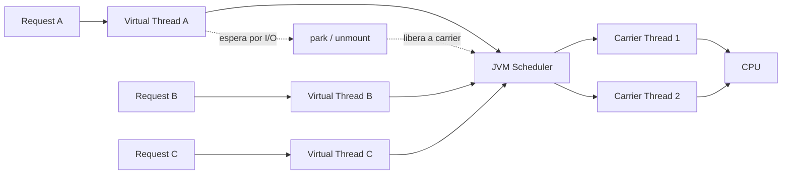
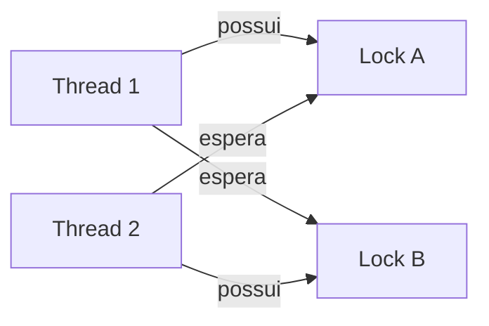

<!-- Banner -->

  

<h2 align="center">👋 Olá! Eu sou o Vinicius</h2>

  Desenvolvedor com foco em <strong>backend, arquitetura e sistemas distribuídos</strong>, trabalhando principalmente com Java, Spring Boot, PostgreSQL, Redis, mensageria e containers.

  Gosto de entender não só <em>como</em> implementar, mas também <strong>por que uma decisão de arquitetura faz sentido</strong> em termos de concorrência, consistência, escalabilidade e operação.

---

## 🚀 Sobre mim

Minha principal área é backend com Java e Spring. Tenho estudado e construído projetos envolvendo multi-tenancy, cache distribuído, mensageria, observabilidade, WebSocket, concorrência na JVM e infraestrutura com Docker/Kubernetes.

Também curso mestrado e venho trabalhando com Machine Learning/Deep Learning, mantendo esse estudo como uma segunda frente técnica.

---

## 🏗️ Arquitetura e backend

Alguns temas que fazem parte do meu estudo e dos projetos que desenvolvo:

- Java moderno e Spring Boot
- PostgreSQL, transações, MVCC, locks e concorrência
- Redis para sessão e cache
- RabbitMQ e processamento assíncrono
- APIs REST e WebSocket
- Multi-tenancy e isolamento por tenant
- Docker, Traefik e Kubernetes
- Observabilidade com métricas e tracing
- Sistemas distribuídos, idempotência e consistência
- Concorrência na JVM, virtual threads e sincronização

---

## 🧵 JVM & Concorrência — visão visual

Um dos assuntos que mais estudo é como a JVM coordena trabalho concorrente, virtual threads e locks.

### Deadlock em uma imagem

📚 **[Ver guia visual completo: virtual threads, pinning, race conditions, deadlocks, MVCC e checklist mental →](docs/jvm-concurrency-visual.md)**

---

## 🔨 Projetos em destaque

### SaaS multi-tenant de e-commerce

Projeto de estudo e produto SaaS com lojas separadas por domínio/subdomínio, painel administrativo por tenant, catálogo, pedidos, Redis, PostgreSQL, Traefik e deploy em VPS com Docker Compose. O repositório principal permanece privado enquanto o produto está em evolução.

### [Modern Concurrency in Java](https://github.com/viniciusscience/modern-concurrency-java-book)

Repositório dedicado a experimentos com concorrência em Java, incluindo virtual threads, executors, sincronização, semáforos e diagnóstico de problemas concorrentes.

### [Machine Learning / Deep Learning](https://github.com/viniciusscience/Machine-Learning-Mestrado)

Projetos acadêmicos e experimentos voltados a classificação de imagens e modelos de aprendizado de máquina aplicados ao mestrado.

### [MCP Easy Setup](https://github.com/viniciusscience/mcp-easy-setup)

Extensão para Visual Studio Code que simplifica a configuração de integrações MCP.

  

---

## 🛠️ Tech Stack

  
  
  
  
  

  
  
  
  

  
  
  
  

---

## 📚 Atualmente estudando

- Arquitetura de software e sistemas distribuídos
- PostgreSQL avançado e concorrência
- Concorrência na JVM e virtual threads
- Observabilidade e operação de serviços
- Machine Learning e Deep Learning
- Integrações MCP e ferramentas para desenvolvedores

---

  <strong>💻 Backend, arquitetura e engenharia de software com foco em entender o sistema por inteiro.</strong>

<!-- Footer -->

  

