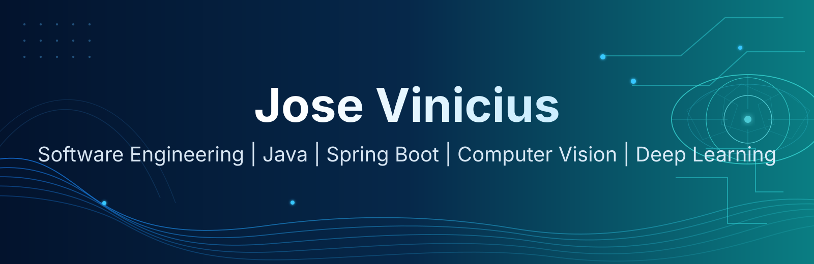

<!-- Banner -->

  

<h2 align="center">👋 Olá! Eu sou o Vinicius</h2>

  <strong>Software Engineer</strong> com foco em backend, arquitetura e sistemas distribuídos. 
  Mestrando em <strong>Computação Aplicada</strong>, com pesquisa em <strong>Visão Computacional e Deep Learning</strong>.

  Java • Spring Boot • PostgreSQL • Sistemas Distribuídos • Computer Vision • Deep Learning

---

## 🚀 Sobre mim

Minha principal atuação profissional é backend com Java e Spring Boot, trabalhando e estudando temas como arquitetura de software, PostgreSQL, multi-tenancy, mensageria, observabilidade, concorrência na JVM e infraestrutura com containers.

No mestrado em Computação Aplicada, desenvolvo uma segunda frente técnica voltada a Inteligência Artificial, especialmente **Visão Computacional e Deep Learning**, conectando engenharia de software com pesquisa aplicada.

Gosto de entender não apenas *como* implementar uma solução, mas **por que uma decisão técnica faz sentido** em termos de concorrência, consistência, escalabilidade, desempenho e operação.

---

## 🔬 Pesquisa — Computer Vision & Deep Learning

Minha pesquisa de mestrado envolve o **desenvolvimento de modelos de aprendizagem profunda para identificação de grandes peixes migratórios capturados pela pesca oceânica brasileira**.

Atualmente venho explorando:

- Classificação de imagens com redes neurais convolucionais (CNNs)
- Transfer Learning e Fine-Tuning
- ConvNeXt e ResNet
- Preparação, organização e análise de datasets de imagens
- Data augmentation e estratégias para reduzir overfitting
- Avaliação de modelos com accuracy, top-k accuracy e matrizes de confusão
- TensorFlow / Keras para treinamento e experimentação
- Visão computacional aplicada a imagens e, futuramente, vídeo

  
  
  

  
  
  
  

---

## 🏗️ Arquitetura e Backend

Alguns temas que fazem parte do meu estudo e dos projetos que desenvolvo:

- Java moderno e Spring Boot
- PostgreSQL, transações, MVCC, locks e concorrência
- Redis para sessão e cache
- RabbitMQ e processamento assíncrono
- APIs REST e WebSocket
- Multi-tenancy e isolamento por tenant
- Docker, Traefik e Kubernetes
- Observabilidade com métricas e tracing
- Sistemas distribuídos, idempotência e consistência
- Concorrência na JVM, virtual threads e sincronização

---

## 🧵 JVM & Concorrência — visão animada

Para quem não trabalha com concorrência no dia a dia, a ideia é enxergar o sistema como um fluxo: uma requisição chega, vira trabalho dentro da JVM e disputa recursos para executar.

### Virtual Threads e Carrier Threads

  

**Como ler:** a bolinha representa uma requisição. Quando ela entra em I/O, a Virtual Thread pode deixar a carrier livre para outra tarefa continuar usando a CPU.

### Deadlock acontecendo passo a passo

  

**Como ler:** Thread A segura o Lock A e espera B. Thread B segura o Lock B e espera A. Quando esse ciclo fecha, nenhuma das duas consegue continuar.

🧪 **[Ver o código do JVM Concurrency Lab interativo](docs/jvm-concurrency-lab.html)** — inclui botões de Play/Reset e cenários de Virtual Threads e Deadlock. O repositório também está preparado para publicar o laboratório via GitHub Pages.

📚 **[Ver guia visual completo: virtual threads, pinning, race conditions, deadlocks, MVCC e checklist mental →](docs/jvm-concurrency-visual.md)**

---

## 🧠 Engineering Notes

Uma coleção curta e visual dos assuntos que venho estudando e aplicando:

| Tema | Nota |
|---|---|
| Backend | [Princípios de backend engineering](docs/backend-engineering.md) |
| JVM | [Virtual threads](docs/virtual-threads.md) |
| Concorrência | [Checklist de concorrência](docs/concurrency-checklist.md) |
| Deadlocks | [Playbook de deadlock](docs/deadlock-playbook.md) |
| PostgreSQL | [MVCC e locks](docs/mvcc-locking.md) |
| PostgreSQL | [Notas de estudo](docs/postgresql-notes.md) |
| Redis | [Sessão e estratégia de cache](docs/redis-strategy.md) |
| Sistemas distribuídos | [Consistência e idempotência](docs/distributed-consistency.md) |
| RabbitMQ | [Fluxo de mensageria](docs/rabbitmq-flow.md) |
| Observabilidade | [Fluxo de diagnóstico](docs/observability-flow.md) |
| Multi-tenancy | [Resolução por domínio e tenant_id](docs/multitenancy-flow.md) |
| Traefik | [Fluxo de roteamento](docs/traefik-request-flow.md) |

---

## 🔨 Projetos em destaque

### 🐟 [Machine Learning / Deep Learning — Mestrado](https://github.com/viniciusscience/Machine-Learning-Mestrado)

Experimentos acadêmicos de Machine Learning e Deep Learning, com foco atual em **classificação de imagens, CNNs, Transfer Learning, ConvNeXt e ResNet** aplicados à pesquisa de identificação de espécies de peixes.

### SaaS multi-tenant de e-commerce

Projeto de estudo e produto SaaS com lojas separadas por domínio/subdomínio, painel administrativo por tenant, catálogo, pedidos, Redis, PostgreSQL, Traefik e deploy em VPS com Docker Compose. O repositório principal permanece privado enquanto o produto está em evolução.

### [Modern Concurrency in Java](https://github.com/viniciusscience/modern-concurrency-java-book)

Repositório dedicado a experimentos com concorrência em Java, incluindo virtual threads, executors, sincronização, semáforos e diagnóstico de problemas concorrentes.

### [MCP Easy Setup](https://github.com/viniciusscience/mcp-easy-setup)

Extensão para Visual Studio Code que simplifica a configuração de integrações MCP.

  

---

## 🛠️ Tech Stack

### Backend & Infra

  
  
  
  
  

  
  
  
  

### AI & Computer Vision

  
  
  
  

### Frontend & Tools

  
  
  

---

## 📚 Atualmente estudando

- Visão Computacional e Deep Learning
- CNNs, Transfer Learning e Fine-Tuning
- ConvNeXt, ResNet e arquiteturas modernas para classificação de imagens
- Arquitetura de software e sistemas distribuídos
- PostgreSQL avançado e concorrência
- Concorrência na JVM e virtual threads
- Observabilidade e operação de serviços

---

  <strong>💻 Software Engineering • Distributed Systems • Computer Vision • Deep Learning</strong>

<!-- Footer -->

  

