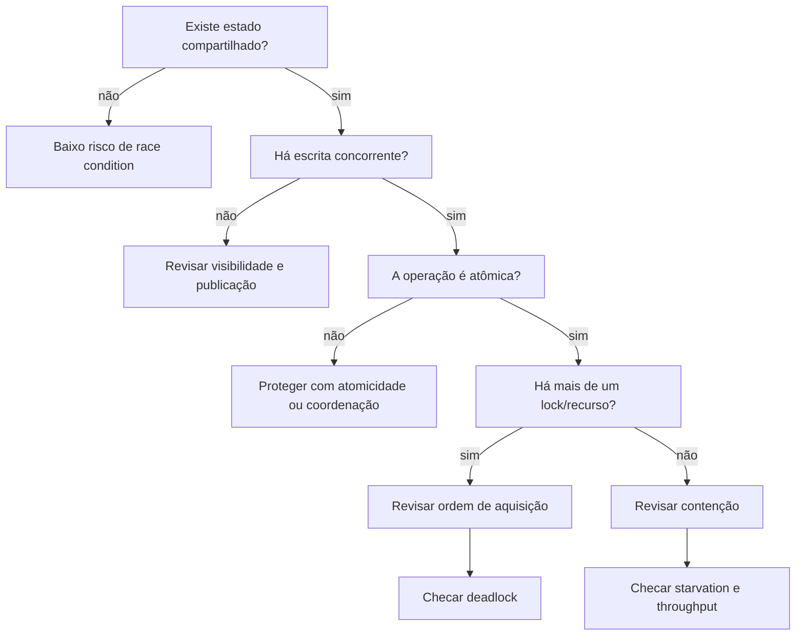

# Checklist de Concorrência em Java

Um roteiro que uso para revisar código concorrente antes de pensar em ferramentas mais complexas.

## Perguntas práticas

- O objeto é realmente compartilhado entre threads?
- Existe alguma mutação depois de publicado?
- `x++`, `check-then-act` ou `read-modify-write` aparecem?
- Um `HashMap` ou coleção mutável é acessado concorrentemente?
- O código depende de visibilidade sem `volatile`, lock ou estrutura concorrente?
- Existe lock aninhado?
- Algum lock permanece adquirido durante I/O, rede ou banco?
- Um pool, semáforo ou conexão pode ficar esgotado?
- Cancelamento e interrupção são tratados corretamente?
- O problema é de concorrência na JVM ou de concorrência no banco?

A primeira habilidade é localizar o estado compartilhado; só depois faz sentido escolher `Atomic*`, `ConcurrentHashMap`, locks, filas ou outras estruturas.
