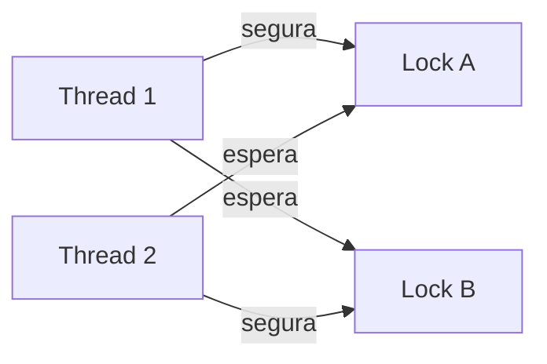
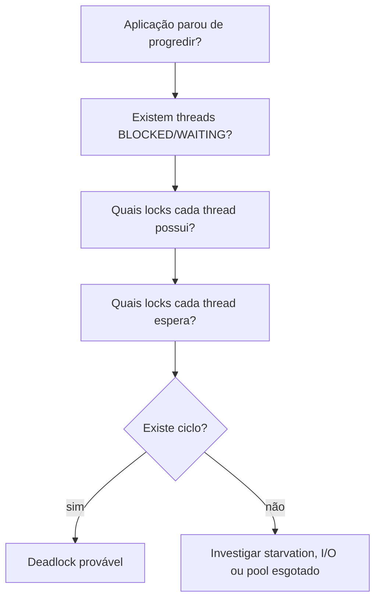

# Deadlock Playbook

Deadlock acontece quando existe um ciclo de espera entre recursos que nunca é quebrado.

## As quatro condições clássicas

1. Exclusão mútua.
2. Hold and wait.
3. Sem preempção automática.
4. Espera circular.

## Estratégias de prevenção

- Definir ordem global para aquisição de locks.
- Reduzir o número de locks mantidos simultaneamente.
- Usar timeout/`tryLock` quando fizer sentido.
- Evitar chamadas lentas enquanto um lock está retido.
- Coletar thread dump/JFR quando houver suspeita em produção.

## Diagnóstico mental

A pergunta principal não é apenas "qual thread está parada?", mas sim "qual recurso ela espera e quem está segurando esse recurso?".
