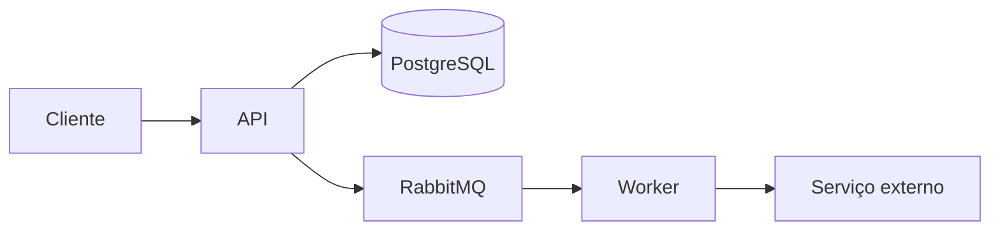
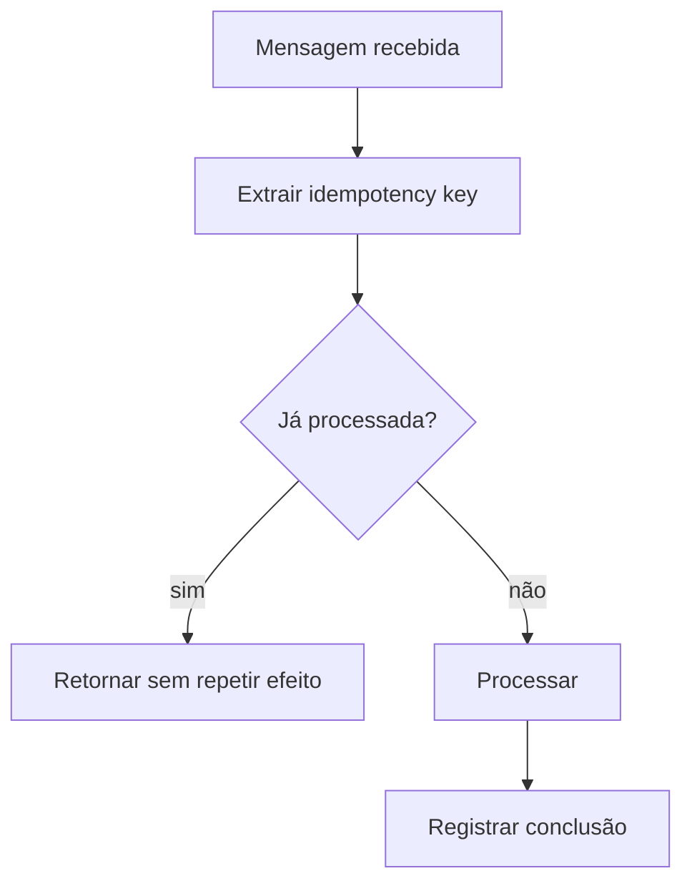

# Sistemas Distribuídos: consistência e falhas

Quando uma operação atravessa processos, máquinas ou serviços diferentes, falhas parciais passam a fazer parte do desenho.

## Perguntas importantes

- O que acontece se o banco confirmar e a publicação na fila falhar?
- A mensagem pode ser entregue duas vezes?
- O consumidor é idempotente?
- Existe retry? Com backoff?
- Como distinguir operação lenta de operação perdida?
- Qual componente é a fonte da verdade?

## Idempotência

## Regra prática

Não assumir exatamente uma vez. Em muitos sistemas é mais seguro desenhar para pelo menos uma vez + processamento idempotente.

Consistência distribuída é principalmente decidir quais estados intermediários são aceitáveis, como recuperar falhas e como provar o que aconteceu depois.
