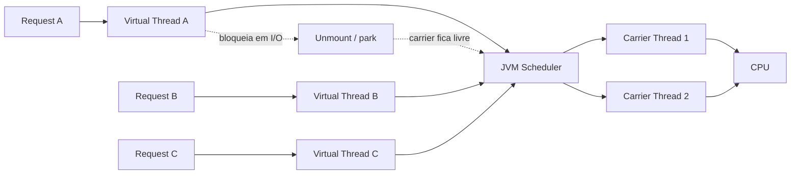
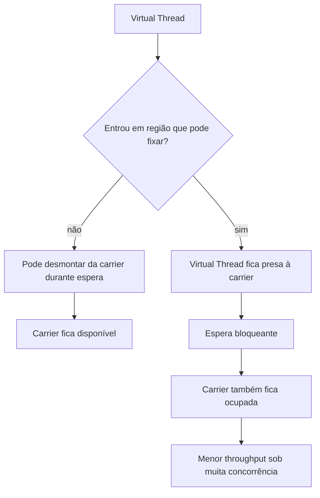
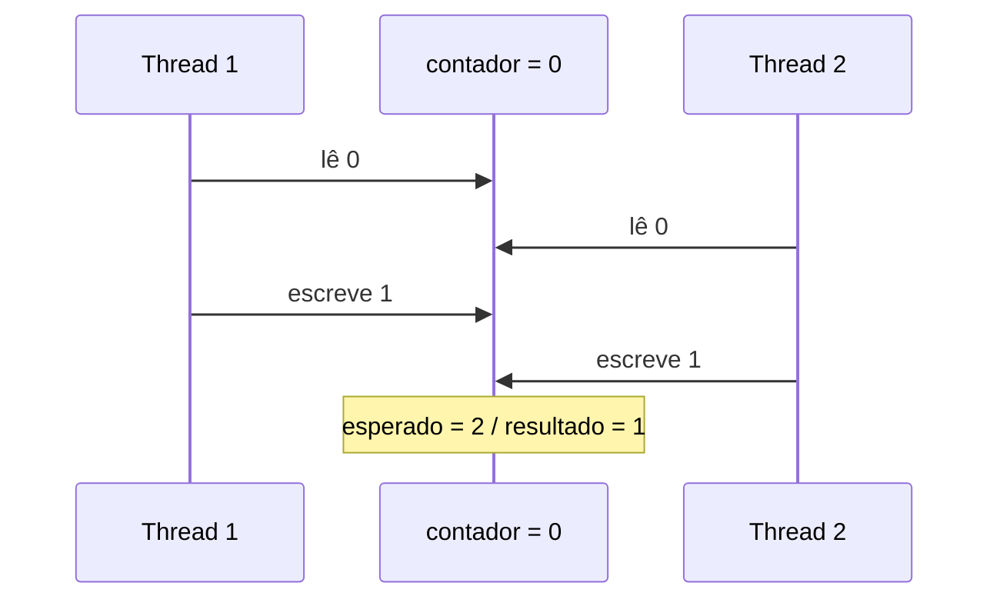
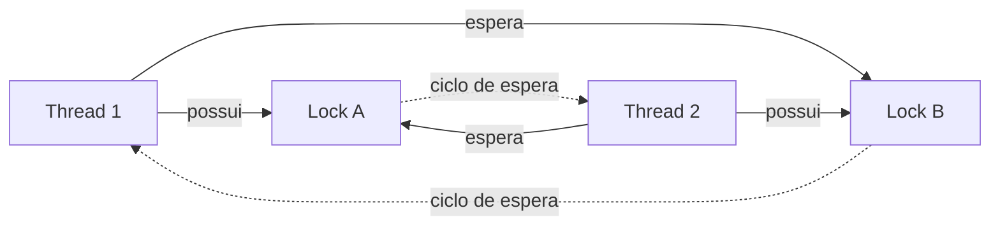
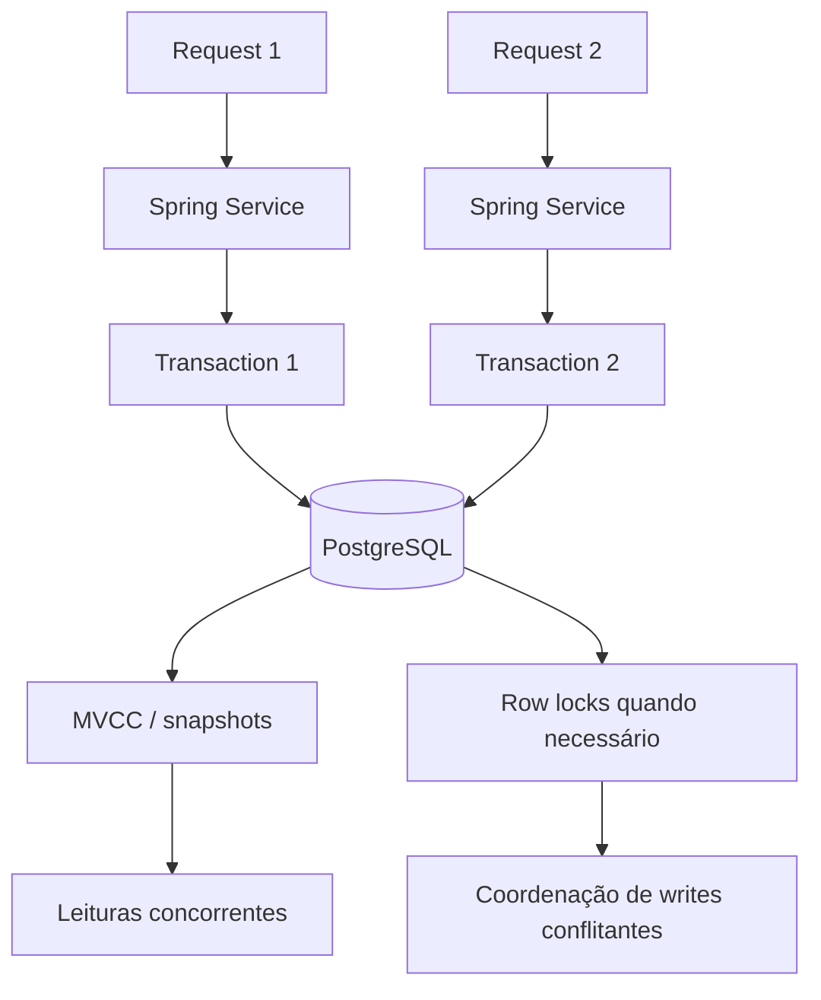
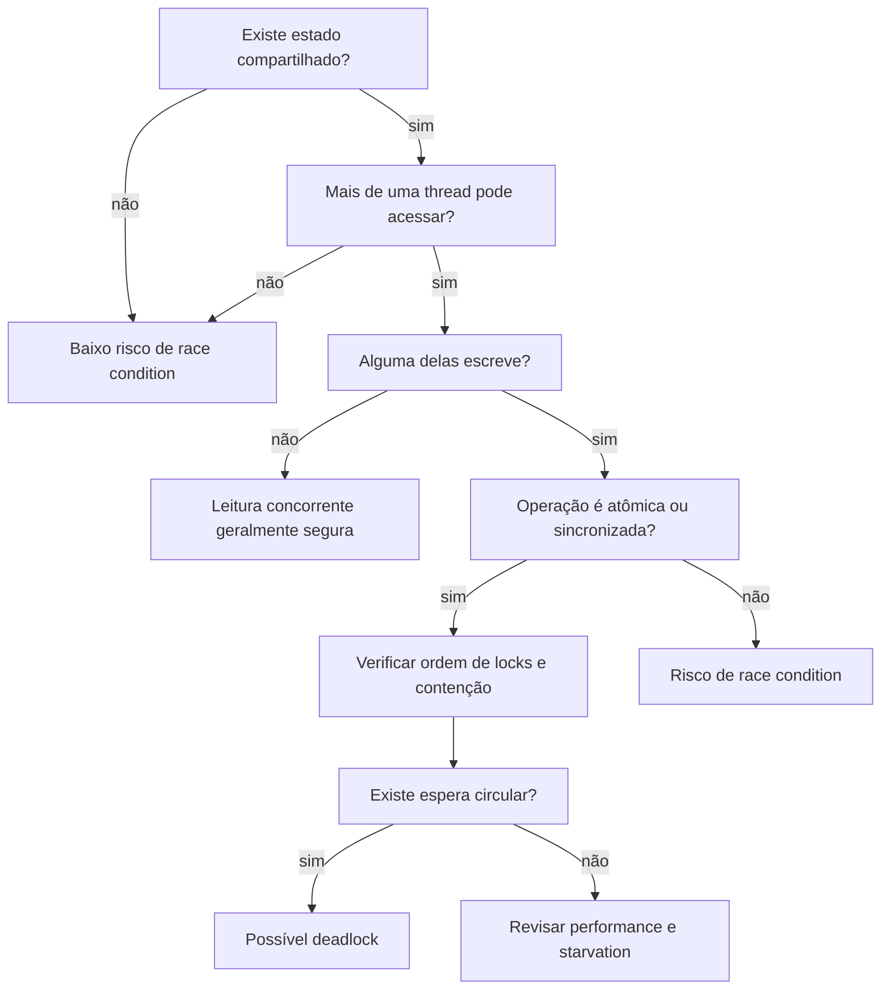

# JVM e Concorrência — visão visual

Este material resume alguns conceitos que estudo na JVM usando diagramas Mermaid renderizados pelo próprio GitHub.

## 1. Como virtual threads usam carrier threads



A ideia central é que milhares de virtual threads não significam milhares de threads de sistema operacional. Quando uma virtual thread pode ser desmontada durante espera de I/O, a carrier thread pode executar outro trabalho.

## 2. O que é pinning



Pinning não significa que a aplicação automaticamente está errada. O problema aparece quando muitas tarefas ficam presas por tempo relevante e consomem as poucas carrier threads disponíveis.

## 3. Race condition



O incremento `x++` parece uma operação única no código, mas conceitualmente envolve leitura, cálculo e escrita. Se duas threads intercalarem essas etapas sem coordenação, uma atualização pode ser perdida.

## 4. Deadlock clássico



Forma mental:

```text
Thread 1: tenho A, preciso de B
Thread 2: tenho B, preciso de A

nenhuma consegue avançar
```

Uma prevenção comum é impor uma ordem global de aquisição de locks.

## 5. Concorrência entre aplicação e banco



MVCC reduz contenção de leitura, mas não elimina a necessidade de locks para escritas concorrentes sobre o mesmo dado.

## 6. Checklist mental ao revisar código concorrente



Esse é o tipo de raciocínio que tento aplicar ao analisar código Java concorrente: primeiro identificar estado compartilhado, depois escrita concorrente, atomicidade, locks e por fim características de progresso do sistema.
