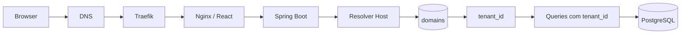
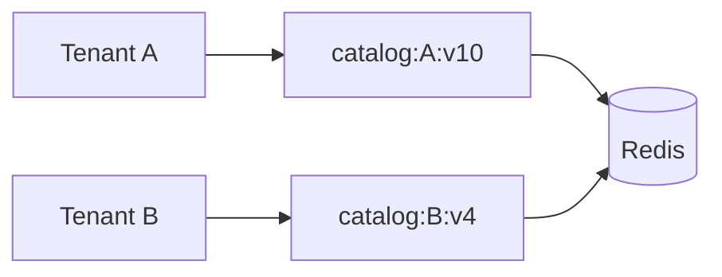

# Multi-tenancy por domínio e tenant_id

Um modelo simples de SaaS multi-tenant pode usar o hostname para descobrir o tenant e `tenant_id` para isolar os dados.

## Invariável principal

Toda operação de negócio precisa carregar o contexto correto de tenant até a camada de persistência.

## Pontos de atenção

- Nunca confiar em `tenant_id` arbitrário vindo do cliente quando ele pode ser derivado da sessão/domínio.
- Testar acesso cruzado entre tenants.
- Separar cache por tenant.
- Preservar `Host` através do proxy.
- Auditar operações administrativas sensíveis.
- Índices frequentemente precisam começar ou incluir `tenant_id` conforme os padrões de consulta.

## Cache

A invalidacão de um tenant não deve limpar o catálogo dos demais. Isolamento é uma propriedade que deve existir no banco, cache, autorização e observabilidade.
