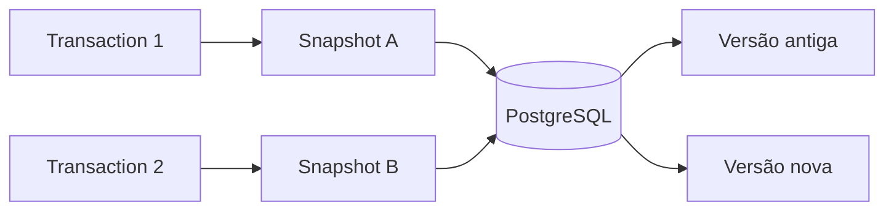
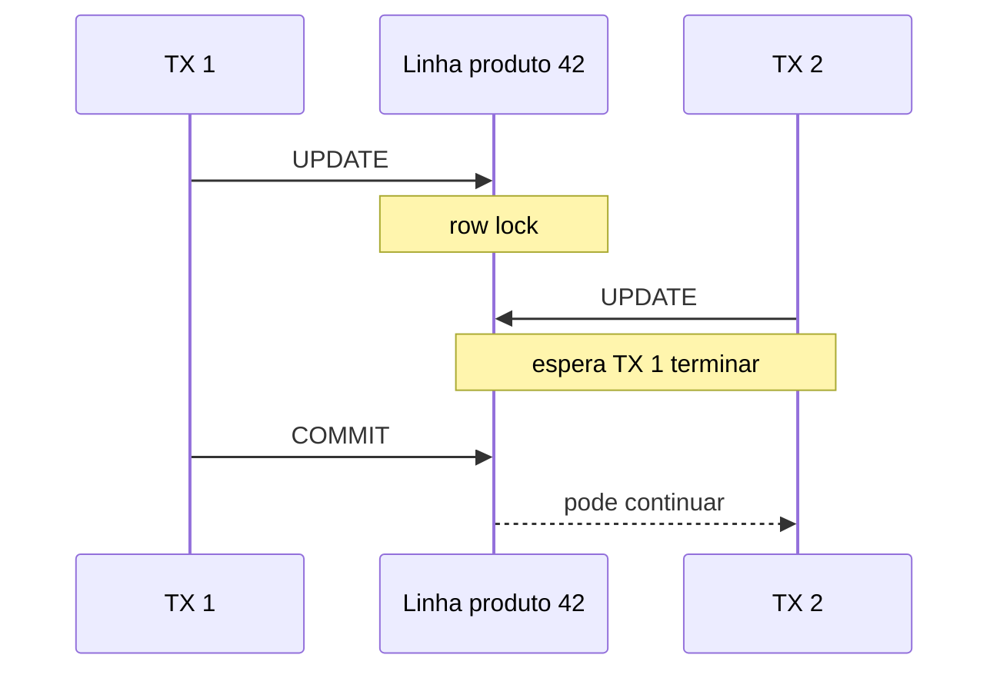

# PostgreSQL: MVCC e Locks

MVCC permite que leituras trabalhem sobre versões dos dados sem bloquear writers na maior parte dos casos, mas isso não elimina locks quando duas transações disputam a mesma escrita.

## Leitura

Um `SELECT` comum normalmente lê a versão visível para seu snapshot.

## Escrita concorrente

## Modelo mental

- MVCC resolve principalmente visibilidade de versões.
- Locks coordenam conflitos reais de escrita e DDL.
- `SELECT ... FOR UPDATE` deve ser usado quando a lógica precisa reservar explicitamente uma linha.
- Índices reduzem trabalho de leitura, mas aumentam custo de manutenção em writes.

A decisão correta depende da invariável do negócio, não apenas de "colocar lock por segurança".
