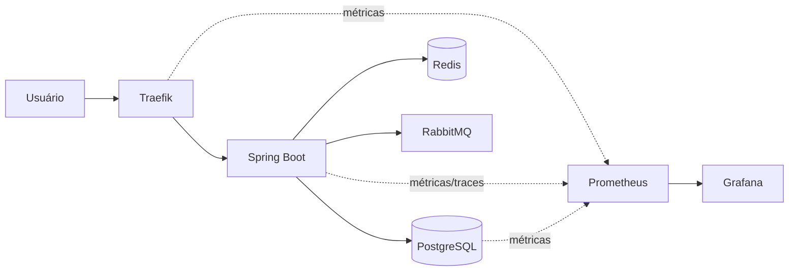
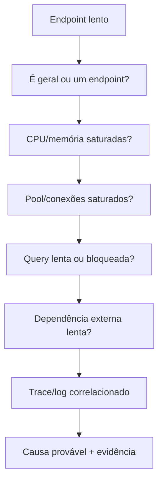

# Observabilidade: do sintoma à causa

Observabilidade não é só ter dashboards. O objetivo é reduzir o tempo entre perceber um sintoma e encontrar a causa.

## Sinais principais

- Latência p50/p95/p99.
- Taxa de erro.
- Throughput/RPS.
- Saturação de CPU, memória, conexões e filas.
- Tempo de queries e locks no banco.
- Cache hit/miss.
- Tamanho e idade de filas.

## Fluxo de diagnóstico

O objetivo é evitar diagnóstico por palpite: cada hipótese deve ser testada com métrica, trace, log ou estado do recurso.
