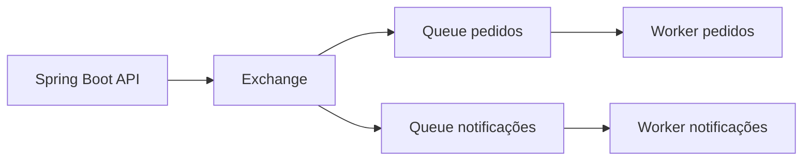
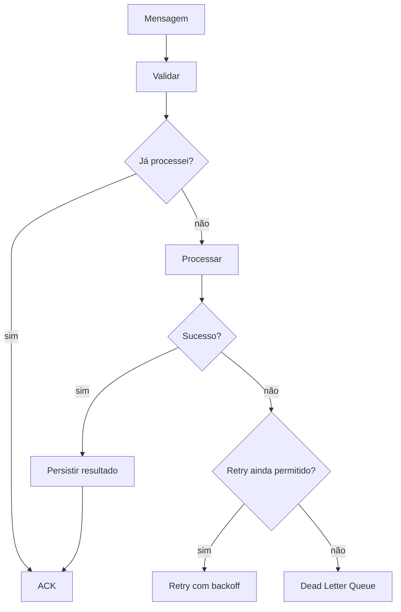

# RabbitMQ: fluxo mental

Mensageria desacopla o produtor do consumidor e permite absorver picos, retries e processamento assíncrono.

## O que a fila resolve

- Desacoplamento temporal.
- Absorção de picos.
- Retry controlado.
- Processamento assíncrono.
- Escala independente de consumidores.

## O que ela não resolve sozinha

- Idempotência.
- Ordem global de eventos.
- Transação entre banco e broker.
- Poison messages.
- Observabilidade de mensagens presas.

## Consumidor robusto

Prefiro pensar em mensageria como um protocolo de entrega sujeito a duplicidade e falhas, não como uma chamada de método remota garantida.
