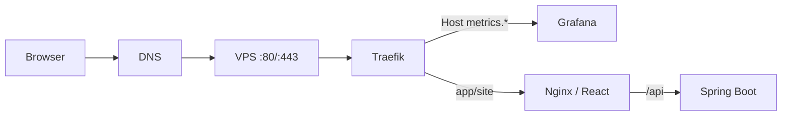
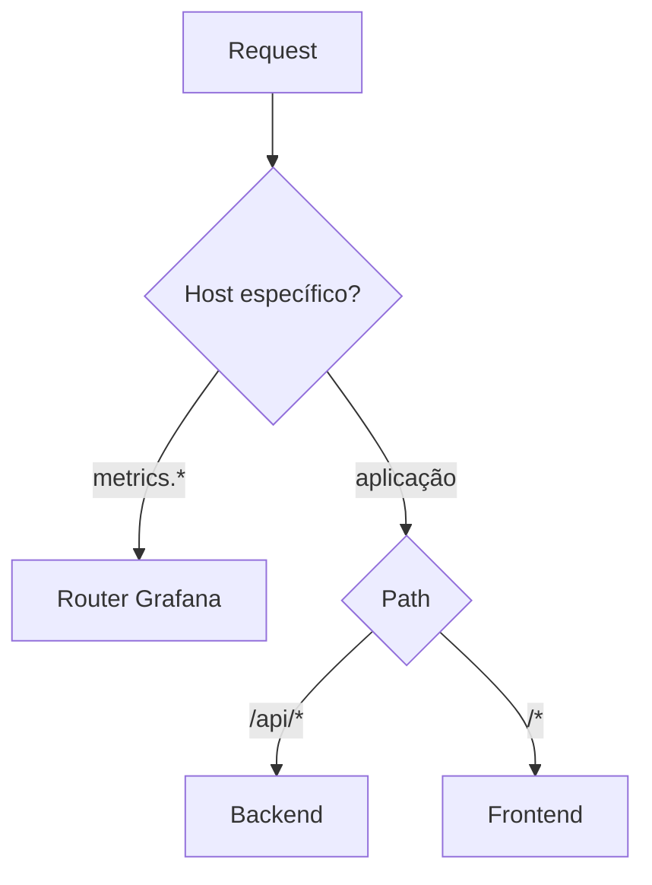

# Traefik: fluxo de requisição

Traefik funciona como a borda do sistema: recebe a conexão externa, escolhe um router e encaminha para o serviço interno correspondente.

## Como pensar nas regras

No desenho atual do meu SaaS, o Nginx ainda participa do proxy de `/api`; uma evolução natural é deixar o Traefik cuidar do roteamento de borda e manter o Nginx focado em servir o SPA.

## Responsabilidades que separo mentalmente

- DNS: resolve nome para IP.
- Traefik: edge routing, Host/Path, TLS e middlewares.
- Nginx: arquivos estáticos e fallback do SPA.
- Spring Boot: regra de negócio e resolução do tenant.
- PostgreSQL/Redis: persistência e estado compartilhado.

Separar responsabilidades ajuda a diagnosticar onde uma requisição está parando em vez de tratar todo o caminho como uma caixa preta.
