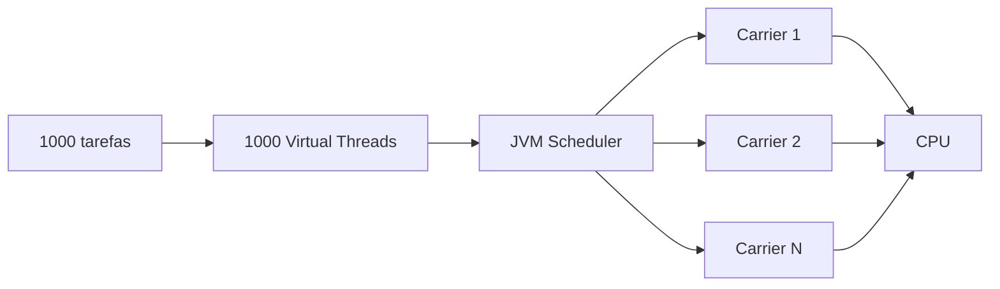

# Virtual Threads na JVM

Virtual threads permitem modelar muitas tarefas concorrentes com código bloqueante simples, sem criar uma thread de sistema operacional para cada tarefa.

## Modelo mental

- Virtual thread representa a tarefa.
- Carrier thread executa temporariamente essa tarefa.
- Ao esperar I/O, a virtual thread pode estacionar e liberar a carrier.
- O ganho principal é escalabilidade para workloads com muita espera, não tornar CPU-bound automaticamente mais rápido.

## O que observar

- Pinning prolongado.
- Bloqueios externos lentos.
- Uso excessivo de `ThreadLocal` com dados pesados.
- Recursos limitados como conexões de banco: virtual threads não removem a necessidade de backpressure.

Um semáforo ou pool continua fazendo sentido quando o recurso real é escasso, mesmo que criar virtual threads seja barato.
